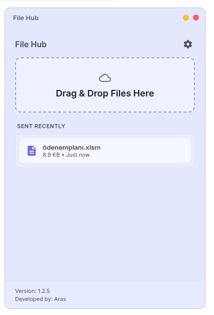

# File Hub

<p align="center">
  
</p>

File Hub is a modern, minimalist desktop application designed to treat your email as a personal file storage cloud. Simply drag and drop files to instantly send them to your own email address.

<p align="center">
  
</p>


## ✨ Features

*   **Drag & Drop:** Effortlessly send files by dragging them onto the interface.
*   **Smart Batching:** Large files are automatically split and sent in 25MB chunks to respect email limits.
*   **Secure:** Your credentials (App Password) are stored locally (`~/.config/FileHub`) and never shared with third parties.
*   **System Tray:** Minimized to the system tray for quick access. 
    *   **Left Click:** Toggle Window
    *   **Right Click:** Open Menu (Show/Quit)
*   **Theme Support:** Auto-detects system theme (Dark/Light) with manual override options.
*   **Auto-Start:** Option to launch automatically on system startup.
*   **Native Feel:** Mac-style window controls and glassmorphism UI effects.

## 📦 Installation

Releases are available for Linux in `.deb` and `.AppImage` formats.

### Debian / Ubuntu (.deb)
Download the `.deb` file and install it using your package manager or terminal:

```bash
sudo dpkg -i file_hub_1.0.0_amd64.deb
```

### Portable (.AppImage)
1.  Download the `.AppImage` file.
2.  Make it executable:
    *   Right-click -> Properties -> Permissions -> "Allow executing file as program"
3.  Double-click to run.

## 🚀 Usage

1.  **Setup:** On first run, click the **Settings (⚙️)** icon.
2.  **Credentials:** Enter your Gmail address and [App Password](https://support.google.com/accounts/answer/185833).
3.  **Send:** Drag files onto the cloud icon. The progress bar will show the status.

## 🗑️ Uninstallation

To completely remove the application:

**Debian/Ubuntu:**
```bash
sudo apt remove filehub
```

**Clean Settings:**
To remove local configuration files:
```bash
rm -rf ~/.config/FileHub
```

## 🛠️ Development

### Prerequisites
*   Node.js (v14+)
*   NPM

### Setup
```bash
# Clone repository
git clone https://github.com/aras/filehub.git

# Install dependencies
npm install

# Run locally
npm start
```

### 🌍 Multi-Platform Build

To build the application for different operating systems:

**🐧 Linux (.AppImage, .deb)**
```bash
npm run dist -- --linux
```

**🪟 Windows (.exe, .nsis)**
```bash
npm run dist -- --win
```

**🍎 macOS (.dmg)**
```bash
# Note: Building for macOS typically requires running on a Mac machine
npm run dist -- --mac
```

## License

ISC
